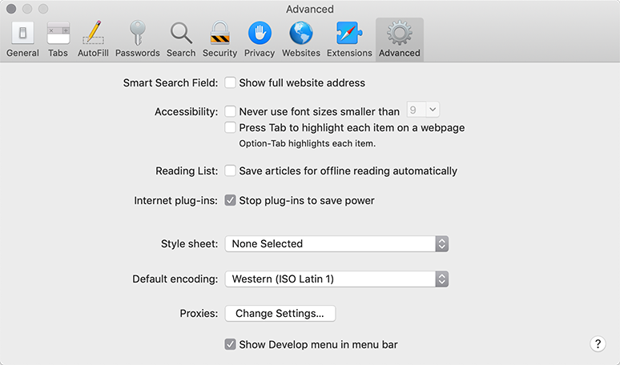

# Dasturchi konsoli

Kod xatolarga moyil. Katta ehtimol bilan xato qilasiz... Oh, men nima haqida gapiryapman? Hech bo'lmaganda [robot](https://en.wikipedia.org/wiki/Bender_(Futurama))emas, balki inson bo'lsangiz, siz mutlaqo xato qilasiz.

Lekin brauzerda foydalanuvchilar sukut bo'yicha xatolarni ko'rmaydilar. Shunday qilib, agar skriptda biror narsa noto'g'ri bo'lsa, biz nima buzilganligini ko'ra olmaymiz va uni tuzata olmaymiz.

Xatolarni ko'rish va skriptlar haqida ko'plab boshqa foydali ma'lumotlarni olish uchun brauzerlarda "ishlab chiquvchi vositalari" o'rnatilgan.

Aksariyat ishlab chiquvchilar ishlab chiqish uchun Chrome yoki Firefox-ga suyanadilar, chunki bu brauzerlar eng yaxshi ishlab chiquvchi vositalariga ega. Boshqa brauzerlar, shuningdek, ba'zan maxsus xususiyatlarga ega bo'lgan ishlab chiquvchilar vositalarini taqdim etadilar, lekin odatda Chrome yoki Firefox uchun "qo'lga olish" ni o'ynaydilar. Shunday qilib, ko'pchilik ishlab chiquvchilar "sevimli" brauzerga ega va muammo brauzerga xos bo'lsa, boshqalarga o'tishadi.

Ishlab chiquvchi vositalari kuchli; ular juda ko'p xususiyatlarga ega. Boshlash uchun biz ularni ochish, xatolarni ko'rib chiqish va JavaScript buyruqlarini ishga tushirishni o'rganamiz.

## Gugl xrom

[bug.html](bug.html)sahifani oching.

Undagi JavaScript kodida xatolik bor. Bu oddiy tashrif buyuruvchilarning ko'zidan yashirin, shuning uchun uni ko'rish uchun ishlab chiquvchi vositalarini ochaylik.

`key:F12` Agar siz Mac-da bo'lsangiz, yoki tugmasini bosing . `key:Cmd+Opt+J`.

Ishlab chiquvchi vositalari sukut bo'yicha Konsol yorlig'ida ochiladi.

Bu biroz shunday ko'rinadi:


Ishlab chiquvchi vositalarining aniq ko'rinishi Chrome versiyasiga bog'liq. Vaqti-vaqti bilan o'zgarib turadi, lekin shunga o'xshash bo'lishi kerak.

- Bu erda qizil rangli xato xabarini ko'rishimiz mumkin. Bunday holda, skriptda noma'lum "lalala" buyrug'i mavjud.

- O'ng tomonda `bug.html:12` xatolik yuz bergan satr raqami bilan manbaga bosiladigan havola mavjud.

Xato xabari ostida ko'k `>` belgi mavjud. Bu JavaScript buyruqlarini yozishimiz mumkin bo'lgan "buyruqlar qatori" ni belgilaydi. Ularni ishga tushirish uchun bosing `key:Enter`

Now we can see errors, and that's enough for a start. We'll come back to developer tools later and cover debugging more in-depth in the chapter <info:debugging-chrome>.

```smart header="Ko'p qatorli kirish"
Odatda, biz konsolga kod qatorini qo'yganimizda va keyin tugmasini `key:Enter`, bosganimizda, u bajariladi.
Bir nechta qator kiritish uchun ni bosing . Shu tarzda JavaScript kodining uzun qismlarini kiritish mumkin. `key:Shift+Enter`.
```

## Firefox, Edge va boshqalar

Ko'pgina boshqa brauzerlar `key:F12` dasturchi vositalarini ochish uchun foydalanadi.

Ularning tashqi ko'rinishi va hissiyotlari juda o'xshash. Ushbu vositalardan birini qanday ishlatishni bilganingizdan so'ng (siz Chrome bilan boshlashingiz mumkin), boshqasiga osongina o'tishingiz mumkin.

## Safari

Safari (Windows/Linux tomonidan qo'llab-quvvatlanmaydigan Mac brauzeri) bu erda biroz o'ziga xosdir. Avval "Ishlab chiqish menyusi" ni yoqishimiz kerak.

Preferences-ni oching va "Kengaytirilgan" bo'limiga o'ting. Pastki qismida tasdiqlash qutisi mavjud:



Endi konsolni almashtirish mumkin. Shuningdek, "Rivojlanish" nomli yangi yuqori menyu elementi paydo bo'lganiga e'tibor bering. Unda ko'plab buyruqlar va variantlar mavjud `key:Cmd+Opt+C`

## Xulosa

- Ishlab chiquvchi vositalari bizga xatolarni ko'rish, buyruqlarni bajarish, o'zgaruvchilarni tekshirish va boshqalarga imkon beradi.
- Ular `key:F12` Windows-dagi ko'pgina brauzerlar uchun ochilishi mumkin. Mac uchun Chrome kerak , Safari: (avval faollashtirish kerak). `key:Cmd+Opt+J``key:Cmd+Opt+C`

Endi bizda muhit tayyor. Keyingi bo'limda biz JavaScript-ga o'tamiz.
